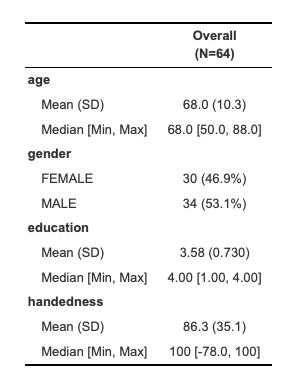
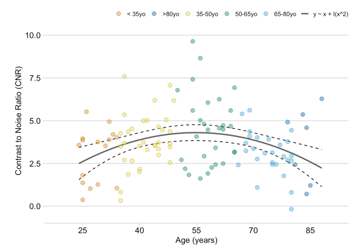
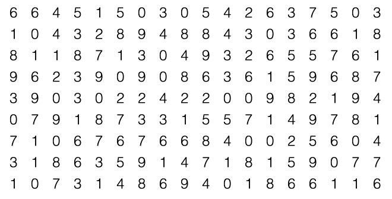
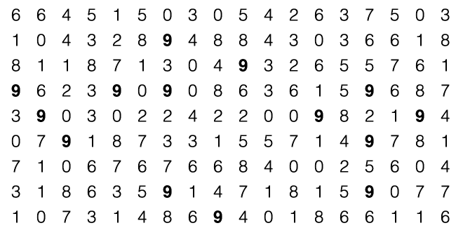
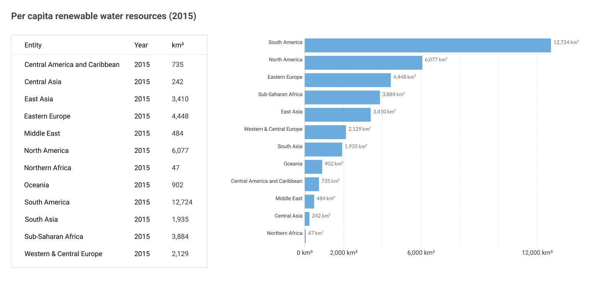
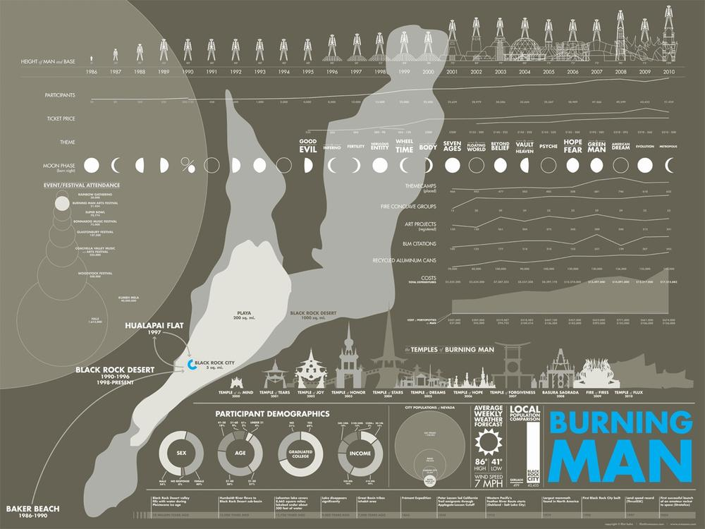
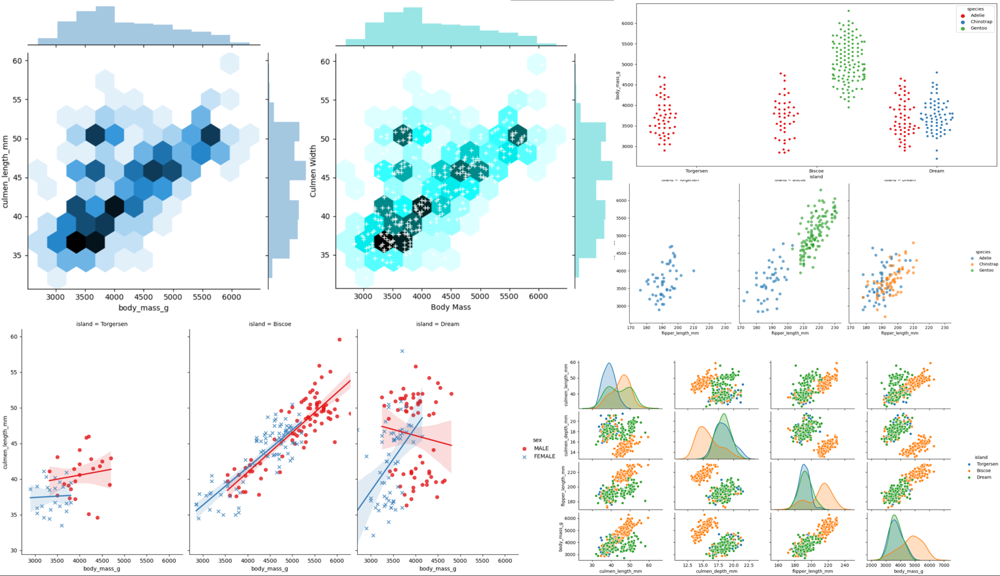

class:  center, middle
```{r setup, include=FALSE}
options(htmltools.dir.version = FALSE)
library(xaringanExtra)
xaringanExtra::use_tile_view()
xaringanExtra::use_tachyons()
xaringanExtra::use_panelset()
xaringanExtra::use_editable()
```


## Introduction to Data Visualization in R

</br>

# Part 1

</br>
</br>


.large[Alessandro Tomassini | Lennart Spindler | Lena Dorfschmidt | 10 February 2020]


---
# The Basics

</br>
</br>

* **Data Visualization** 
    - *the representation and presentation of data that exploits our visual perception abilities in order to amplify cognition*  <font size = "3" color = "gray">(Andy Kirk in Data Visualization: A successful Design Process) </font>
    
    - *refers to the mapping between numerical data and graphic elements (e.g. lines or points in a chart)* <font size = "3" color = "gray">(Wikipedia)</font>
  
</br>

* **Between Art & Science**: both design and statistical skills are required to visualize effectively


---
# The Basics

.pull-left[
Tables are generally used where users will look up a specific measurement


]
.pull-right[
Charts are used to show patterns or relationship in the data for one or more variables



]

---

# Visual  Perception & Data Visualizaion

**Pre-attentive** attributes: differences in line length, shape, orientation, distance, and color can be distinguished readily without processing efforts.
.pull-left[Attentive: count the 9s


]

--

.pull-right[Pre-attentive: count the 9s


]
</br>
</br>


---
# Visual  Perception & Data Visualizaion
Effective data visualization exploits pre-attentive processing and attributes




---
# Data Visualization vs Infographics
**Data visualization** is usually often **aesthetically barren** and **data-rich**

**Infographics** is **aesthetically rich** (to draw attention) and relatively **data-poor** (custom treatment of the information)

.center[]


---
#Eploration vs Explanation
The two serve different purposes, some tools and approaches are appropriate for one and not for the other.
.panelset[
.panel[.panel-name[Exploratory data visualization]
.pull-left[

* Typically part of the *data analysis* phase.

* Used to get a sense of data points relationship before embarking on any complex modelling exercise.

* Also useful to identify anomalous outliers.

* Generally best done at a high level of granularity.

]

.pull-right[]


]

.panel[.panel-name[Explanatory data visualization]
.pull-left[

* Typically part of the *presentation* phase.

* Used to convey a *story*.

* It is a process of selecting focused evidence in support of the story you are trying to tell.

* Need to filter out distracting and irrelevant information.

]

.pull-right[]


]

]
---
class:  center, middle

#Thank you for your attention

