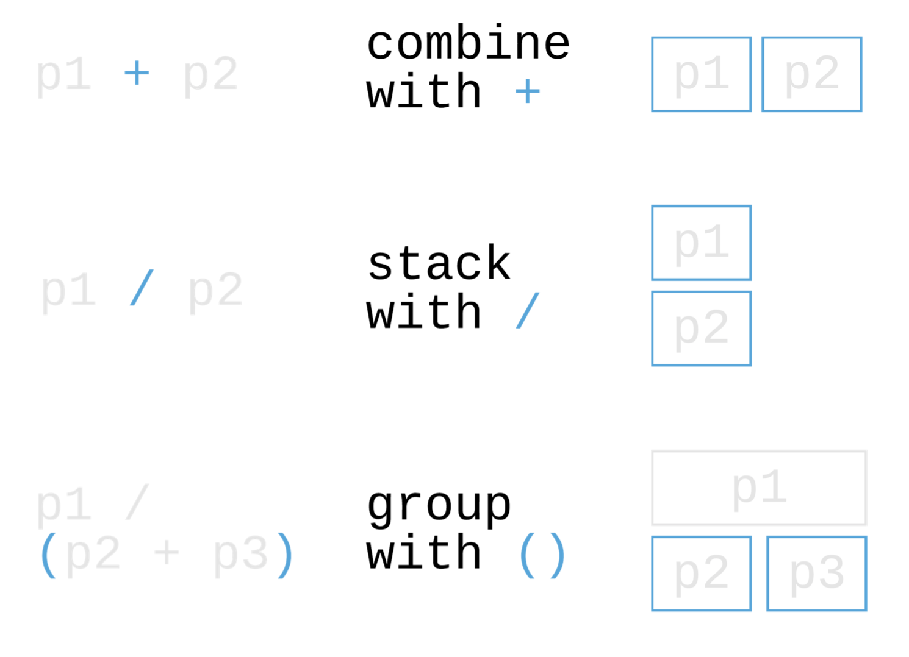

This is the second part of the introduction to data visualization (in R).

In this practical we will learn:


1. How to build plots from simpler to more complex
2. How to communicate a story with annotations
3. How to combine plots to convey a story


We will be using `ggplot2` to plot our data. Let's make sure you have that installed. 

```{r message=FALSE, warning=FALSE, include=FALSE}
if (!require("ggplot2")) install.packages("ggplot2")
if (!require("tidyverse")) install.packages("tidyverse")
if (!require("patchwork")) install.packages("patchwork")
if (!require("forcats")) install.packages("forcats")
if (!require("ggforce")) install.packages("ggforce")
if (!require("ggeasy")) install.packages("ggeasy")

library(ggplot2)
library(tidyverse)
library(forcats)
library(ggforce)
library(ggeasy)
```

Similarly to the previous practical, we will use the data from the Baker 2016 paper.

```{r}
# Load in our data:
baker2016 = read.table('baker2016_artificial.txt', header = T)
```

```{r, echo=FALSE}
knitr::kable(
  head(baker2016[,c(26,9,16,18)]), # This is the table we will plot
  booktabs = TRUE) # We determine the formatting style as 'booktabs'
```
# What is your story?

In the first practical we noticed that almost the same proportion of participants reported that they were familiar/not familiar with the term 'Open Science'. The participants in the study came from different fields. One possibility is that the dichotomy in familiarity may be related to  how much participants trust the work in their field to be reproducible (e.g. less trust -> more familiarity). We show that this is not the case and that confidence in reproducibiity is generally high amongst all the fields.


# 1.Build plots from simpler to more complex


## Histogram for 1D data (e.g. counts)
Let's plot again the histogram showing the overall familiarity with Open Science


We use color to highlight. You can add a conditional argument to the `color` or `fill` options to highlight certain aspects of your plot i.e. we may want to highlight the participants who responded saying  either they weren't familiar enough with the term *Open Science* or reasonably familiar to highlight the dichotomoy.

In order to highlight these aspects, we add the conditional argument `ifelse(flagged %in% c('A reasonable amount','Not enough'),1,2)` to our color option. Note `%in%` is appropriate here instead of `==` since we the conditional statements includes more than one condition. Wrapping it in `as.factor()` simply makes is a discrete variable, which would allow us to choose a discrete colormap. 

Also, we would like plot the results from 'Too much' to 'Not enough' familiarity. This is achieved through the command `factor()` by specifying the desired order of levels and setting `ordered = TRUE`.

```{r message=FALSE, warning=FALSE}
#some labels are way too long
baker2016 <- baker2016 %>%
      mutate(field = str_replace(field,"Astronomy and planetary science","Astronomy")) %>%
      mutate(field = str_replace(field,"Earth and Environmental Science","Earth Sciences")) %>%
      mutate(flagged = str_replace(flagged,"A reasonable amount","Fair")) %>%
      mutate(flagged = str_replace(flagged,"I am unsure","Unsure")) %>%
      mutate(flagged = str_replace(flagged,"Not enough","Little")) %>%
      mutate(flagged = str_replace(flagged,"Too much","Large"))
baker2016$flagged <- factor(baker2016$flagged,levels = c('Large','Fair','Unsure', 'Little'), ordered = TRUE)

hist.familiarity <- ggplot(baker2016, aes(x= flagged, fill = as.factor(ifelse(flagged %in% c('Fair','Little'),1,2)))) +
  geom_bar()+
  xlab('Response')+
  ylab('Count')

#plot it
hist.familiarity 
```


## Scatterplot - 2D data: Plot a relationship between variables

We want to check whether the dichotomy in high and low familiarity with Open Science is somehow a reflection of different levels of trust between fields.

First of all, we cannot use raw count numbers because they differ between fields. Also, we need a more 'compact' measure to summmarise trust and familiarity.

An easy solution, is to calculate a ratio for each field between those who are familiar/unfamiliar with open science as well as a ratio between the number of participants who trust (>50% reproducibility) or not trust (<50% reproducibility) their field. This is accomplished within the first lines of code where two new columns (ratio.Familiarity and ratio.Trust) are created to accommodate the ratios. The pipe `%>%` operator simply indicates that the argument on the left (or its outcome) is the input to the argument on the right. `group_by(field)` allow to execute the  operations in `mutate()` (i.e. creation of a new column) separately for each level of field. For more information you can have a look at the 'tidyverse' web-page.

We use a scatterplot and a linear regression to visualise the relationship between the ratios.


```{r}
#calculate ratio between confidence/non confidence on general knowledge of reproducibility 
baker2016 <- baker2016 %>% group_by(field) %>% mutate(ratio.Familiarity = sum(flagged == 'Fair')/sum(flagged == 'Little'))

#calculate ratio between confidence/non confidence on  reproducibility in their own field
baker2016 <- baker2016 %>% group_by(field) %>% mutate(ratio.Trust = sum(as.numeric(sub("%", "",proportion_reproducible)) >50)/sum(as.numeric(sub("%", "",proportion_reproducible)) <51))


#plot
scatterPlot <- ggplot(baker2016,aes(ratio.Trust, ratio.Familiarity, color=field)) + 
  # show data points with size 3
  geom_point(size = 3) + 
  # set x/y axes limits
  xlim(0,5)+ylim(0,5)+
  # we want to see a linear regression (this is for illustrative purposes, analyses should be done aside)
  geom_smooth(method = "lm", se=FALSE, color="black", formula = y ~ x)+
  # use a minimalist theme to remove clutter (e.g. background color, axes)
  theme_minimal()

#plot it
scatterPlot
```


## Heatmap - 3D data: Plot a relationship between variables

In our exploratory visualization we have used density plots to visualise how the distributions of values of trust in reproducibility differ between the fields

```{r}
ggplot(baker2016, aes(group= field, fill=field, x = proportion_reproducible)) + 
  geom_histogram(stat = 'density') + 
  facet_wrap(~field)
```


That was useful for us to get an idea of how the data were distributed. However now we want to convey the message that there are not major differences between fields in that they all share a high level of trust.
For this purpose, we use a more compact visualisation using a heatmap. 

Note, we first summarise the data using proportions as we are interested in relative values as opposed to raw counts.


```{r message=FALSE, warning=FALSE}

# create a new dataframe df
df <- baker2016 %>% 
      #select only two columns
      select(c('proportion_reproducible','field')) %>% 
      #perform the analyses on each level of proportion_reproducible by field
      group_by(field,proportion_reproducible) %>%
      #count the items for each level
      summarise(n = n()) %>%
      #calculate proportion for each level
      mutate(freq = n/sum(n))
     
      #order factors
  df$proportion_reproducible <- factor(df$proportion_reproducible,levels = paste0(seq(0,100,10),'%'), ordered = TRUE)
```
```{r}
      

#Assign color variables
col1 = "#d8e1cf" 
col2 = "#438484"


heatmap <- ggplot(df, aes(proportion_reproducible, field)) + 
  #select the plot type and filling, separation lines = white
  geom_tile(aes(fill = freq),colour = "white", na.rm = TRUE) +
  #use the assigned colors above for the filling
  scale_fill_gradient(low = col1, high = col2) +  
  theme_bw() + theme_minimal() + 
  theme(panel.grid.major = element_blank(), panel.grid.minor = element_blank())

heatmap


```


# 2.Communicate a story with annotations

We will use  {ggforce} to annotate our plots
```{r}
library(ggforce)

```


Let's remove the legend and add a title and subtitle

```{r}
hist.familiarity <- hist.familiarity + 
  theme_minimal()+
  #we do not need a legend as colors are to attract the attention
  theme(legend.position = 'none')+
  ggtitle('"Open Science" familiarity')
  
hist.familiarity  
```


The scatter plot looks quite complex and needs some extra information to become completely clear.
We will add text to indicate the meaning of illustrative data points using `geom_mark_ellipse` from {ggforce}. The `filter = field == 'Astronomy and planetary science'` option indicates which data point(s) need to be highlighted.

We also add a title and subtitle to convey the main message of the plot

```{r}

scatterPlot<- scatterPlot+
  #add  text to make the figure more understandable at first glance
  geom_mark_ellipse(aes(filter = field == 'Astronomy', label = 'Astronomy',
                                  description = 'Low familiarity with Open Science but high trust in the field '),label.fontsize = 8) +
  geom_mark_ellipse(aes(filter = field == 'Medicine', label = 'Medicine',
                                  description = 'Low familiarity with Open Science and low trust in the field '),label.fontsize = 8) +
#Tidy up labels for readability
   xlab('Trust (ratio)') + ylab('Familiarity (ratio)') +
#Add title and subtitle so that readers have immediate understanding of the plot  
  ggtitle("Familiarity with Open Science vs Trust in the field",subtitle = 'Linear regression (black line) shows no effect')

# plot it
scatterPlot
```


Finally we will add title and subtitle to the heatmap and


```{r}
heatmap<- heatmap+
  #add legend title
  guides(fill=guide_legend(title="Prop"))+
  #add title and xy labels)
  labs(title = "Trust in reproducibility", x = "Percentage reproducibility", y = "Field") +
  # rotate xtick labels to avoid orverlap when trying to combine images
  easy_rotate_x_labels(side = "right")
#plot it
heatmap
```


# 3.combine plots to convey a story

```{r}
library(patchwork)
```
We will use {patchwork} to combine plots together into a figure. An alternative package is {Cowplot}. 




```{r}
hist.familiarity + heatmap
```

Add tag to plots

```{r}
hist.familiarity + theme(plot.margin = unit(c(30,30,30,0), "pt"))+heatmap + plot_annotation(tag_levels = 'A') + plot_annotation(title = 'Familiarity with Open Science and Trust in preproducibility',
                                                                                                                               subtitle =  'High discrepancy in familiarity but overall high trust in reproducibility',
                                                                                                                               caption = 'Disclaimer: None of these plots are insightful')
```


```{r}
scatterPlot+plot_layout(guides = 'collect') + plot_annotation(tag_levels = c('A','1'), tag_prefix = 'Fig. ', tag_sep = '.', tag_suffix = ':') & theme(plot.tag=element_text(size = 10)) 
```


Combine altogether. `plot_layout(guides = 'collect')` sometimes is needed to align the legends.
`theme(plot.margin = unit(c(0,60,0,0), "pt"))` is to add some space between the plots.
It will require a bit of fiddling to obtain adjust the figures (e.g. for readibility of percentages)


```{r}
scatterPlot / (hist.familiarity + heatmap)
```

# Further Resources

This [website](https://www.r-graph-gallery.com/index.html) could be considered the bible of plotting data in R. 
This ggplot [cheatsheet](https://rstudio.com/wp-content/uploads/2015/03/ggplot2-cheatsheet.pdf) is great to have at hand. 
[Here](https://patchwork.data-imaginist.com/articles/guides/layout.html) you can find info on how to control layouts with patchwork.
